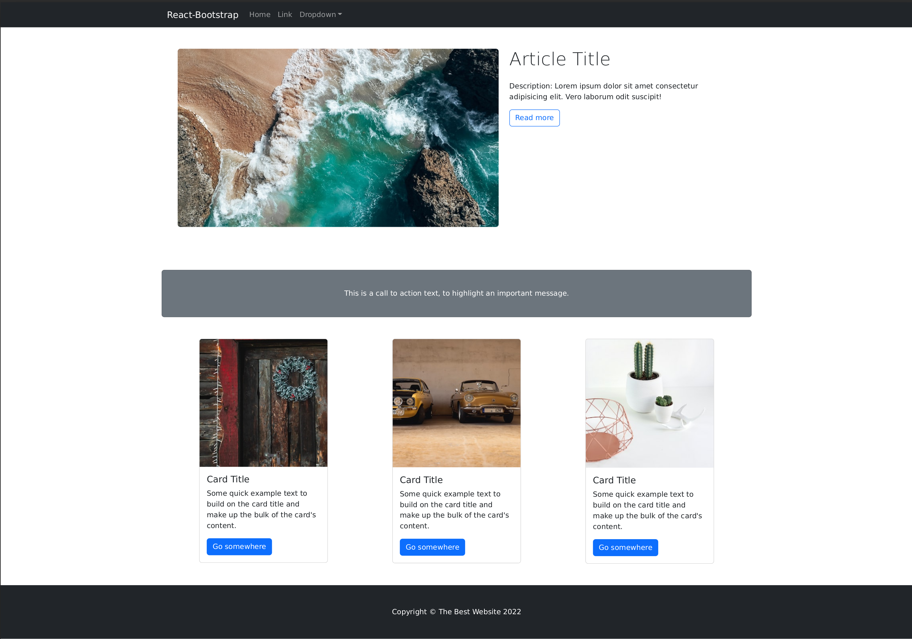

# SPA-boilerplate-bootstap-v5
## Build a real page with React and Bootstrap 5
In this exercise we are going to use the React-Bootstrap library. You can read about the library here: https://react-bootstrap.netlify.app/
Only use Bootstrap classes for styling: https://getbootstrap.com/docs/5.0/getting-started/introduction/

1. Create a react app with: `npx create-react-app .`
2. Check the documentation and install React-Bootstrap via npm: https://react-bootstrap.netlify.app/getting-started/introduction#installation
`npm install bootstrap react-bootstrap`

3. Import the needed bootstrap css too, to be able to use bootstrap classes later on:
https://react-bootstrap.netlify.app/getting-started/introduction#css 
The following line can be included in your src/index.js or App.js file: `import 'bootstrap/dist/css/bootstrap.min.css';`

4. Clean up the React Template: remove the content of the `<header>` element in `app.js`, and it’s classes too. Remove the `app.css`.
	Check out how you can import components from react-bootstrap: https://react-bootstrap.netlify.app/getting-started/introduction/#importing-components and add a simple navbar to the header element from react-bootstrap: https://react-bootstrap.netlify.app/components/navbar/
Change the `background` and the `variant` to “dark”

5. Create a main element and inside of it add a grid container. Inside the container create one row with 2 columns having 7/5 ratio: https://react-bootstrap.netlify.app/layout/grid/#responsive-grids

6. Add margin-top  and padding-left and right to the row using bootstrap classes: https://getbootstrap.com/docs/5.0/utilities/spacing/#margin-and-padding

7. Import the image API and add a fluid and rounded Image to the first column: https://react-bootstrap.netlify.app/components/images/#rb-docs-content 
For the image source use Unsplash random images, eg.: "https://source.unsplash.com/random/900x500"

8. Add a `<h1>` and a `
` element to the second column. Add a “read-more” outline `<button>` after the paragraph: https://react-bootstrap.netlify.app/components/buttons/#outline-buttons

9. Create a new row, and add a card element with a paragraph with some text, change the background, and the text color.

10. Add a Card Group with three cards, using random Unsplash images again. https://react-bootstrap.netlify.app/components/cards/#basic-example

11. And finally create a `<footer>` element, with a centered paragraph text. 

 **That was it, you have your first single page with React and Bootstrap!** 🥳

# Reference image: 

